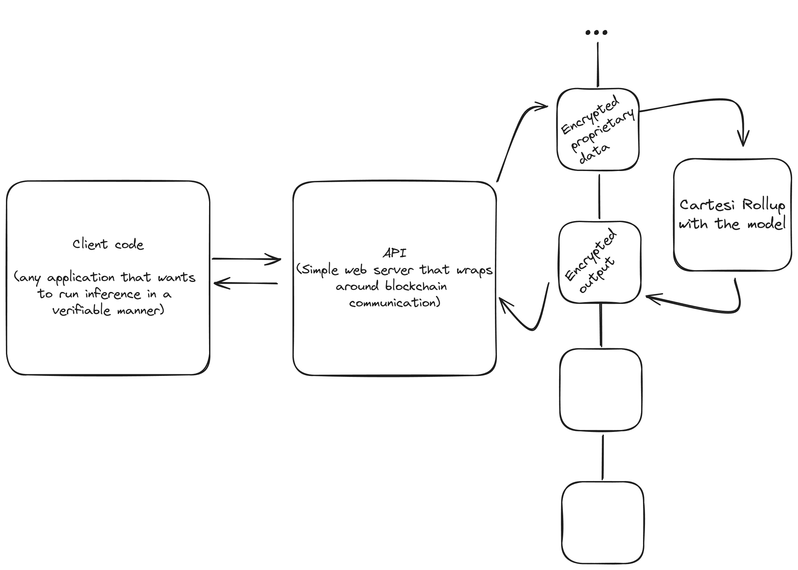

# Introducing Cartesi-Weather: A Secure and Auditable Weather Forecasting System for Informed Agriculture Investment

In the agriculture futures market, weather conditions can make or break crop productivity, significantly impacting investment decisions. To help market participants make more informed choices, we're proud to introduce Cartesi-Weather, a pioneering project that combines the power of PyTorch and Cartesi Machine to provide accurate and secure weather forecasts.

By leveraging a first of its kind custom Long Short-Term Memory (LSTM) model inside a Cartesi Virtual Machine (CVM), we've created a highly secure and auditable system that protects sensitive user data while delivering reliable weather predictions. 

This innovative solution enables agriculture futures market participants to better anticipate weather-related risks and opportunities, making more informed investment decisions.

What sets Cartesi-Weather apart is its ability to outsource computationally expensive weather forecast computations without relying on trusted third-party service providers.

By running PyTorch models inside the Cartesi Machine, investors can tap into scalable and secure infrastructure without shouldering the burden of expensive hardware or relying on untrusted intermediaries. This decentralized approach ensures that sensitive data remains private and secure, while still providing access to accurate and timely weather forecasts.

Furthermore, Cartesi-Weather provides a general framework for running inference on any PyTorch model within the Cartesi Machine, offering a versatile foundation for a wide range of applications. Developers can easily swap models and adjust client inputs, unlocking new possibilities for secure and private AI-driven insights.

## The Quest for a Weather Prediction Model

Our journey began with a bold ambition: to run Graphcast, a state-of-the-art weather prediction model, inside the Cartesi Machine. With its impressive documentation and Jax implementation, we thought we'd found the perfect candidate.

We embarked on a quest to compile Jax for the RISCV64 target so that we could use it inside the CVM. Unfortunately, The complexity of the Bazel build system used in the Jax project led us to pivot to a more feasible solution given our time constraints.

After hours of research, we explored alternative models, including the MetNet family of models by Google and NVIDIA’s Fourcast, before stumbling upon PanguWeather, a Huawei-developed model with a usable ONNX implementation targeting CPU inference. We successfully ran it on our beefiest laptop, which, unsurprisingly, crashed twice due to memory usage.

Undeterred, we turned to a high-end computer cluster at the Universidade de São Paulo to validate the model, where some of our team members conduct research. To our relief, the model ran successfully, giving us a much-needed boost of confidence.

However, our joy was short-lived. As we increased the Cartesi Machine's memory size in order to make the model fit inside it, we encountered severe performance degradation. We soon discovered that the default validator service configuration in the Cartesi CLI docker images was the culprit, causing our application to timeout.

Through some clever trickery - i.e. 2 lines in a dockerfile - we managed to fork the Cartesi CLI repo, rebuild the CLI from source, and tweak the validator service configuration to accommodate our needs. This allowed us to increase the Cartesi Machine's memory size to 2GB - any further and it crashed, which meant we couldn’t make PanguWeather work inside the CVM.

Faced with these limitations, we decided to pivot to simpler models that could run with lower memory requirements. We divided our team into two groups: one would implement a simple model using m2cgen, while the other would develop a custom LSTM model in PyTorch. This strategy ensured that we'd have a working project at the end.

Using a dataset of weather observations from Ulsan, South Korea, we trained our models and eventually succeeded in implementing a custom LSTM model in PyTorch, achieving decent accuracy in predicting the weather.

But, as we soon discovered, getting inference to work was only half the battle...

## The Complete System: Seamless Interaction and Confidentiality
Our application's core objective was to provide a seamless interface for users to interact with the Dapp through a traditional API, eliminating the need for direct blockchain interaction. To achieve this, we set up a simple Flask web app.

This approach offers a more user-friendly onboarding experience, as end-users don't need to interact with the blockchain to reap the benefits of running code inside the Cartesi Virtual Machine.

Our system consists of two primary components: the API and the Dapp, which runs inside the CVM. Developers can leverage the API to integrate verifiable inference into their own applications, and we've provided an interactive example to demonstrate this.

A key feature of our application is the confidentiality of the input data used in our model. To ensure data privacy, clients encrypt their data using the public key from the Cartesi Rollup. This allows users with sensitive, proprietary data to utilize the application without compromising their secrets, since all data is public in the blockchain.

Here's how it works: once the encrypted data is stored on the blockchain, it's pulled into the CVM, where it's decrypted using the CVM's private key. The CVM then runs inference on the decrypted data and sends the encrypted output back to the client using their public key.

This secure process ensures that only the client, who owns the data, and the auditable CVM, which communicates exclusively with the blockchain, can access the decrypted data - which in the context of financial markets is usually proprietary and confidential. As a result, data confidentiality is guaranteed, providing an additional layer of trust and security for our users.

## The Real-World Viability of inference in Cartesi Rollups and Our Weather Prediction Project

As we reflect on our weather prediction project, we must consider its practicality and the viability of Cartesi Rollups in the real world. While our project has significant value for the Cartesi ecosystem, providing a reference implementation for PyTorch-based AI applications to run as Cartesi Rollups, its practicality is limited by the current performance and memory bottlenecks.

Our code is designed to be readable and well-documented, providing a solid foundation for other applications to build upon. Moreover, the ability to perform inference in a fully auditable manner is a significant advantage, allowing suspicious end-users to validate and trust every step of the process.

However, the question remains: what is the cost of verifiability? The performance and memory bottlenecks we encountered are significant limitations. While we were able to run a machine with 2GB of memory, it’s still very limiting in the context of AI applications.

On the other hand, the flexibility of using the Linux development workflow is a major advantage. Despite the challenges, the ability to run inference, even a small one, inside a RISC-V64 virtual machine in an auditable manner, while maintaining data confidentiality throughout the process, is a remarkable achievement.

While our project may not be the most practical solution in its current form, it is an interesting experiment that showcases the potential of Cartesi Rollups. We will continue to monitor performance improvements in the Cartesi Machine, as these advancements will undoubtedly unlock new possibilities and make future projects more viable in the real world.

If you've made it to the end, we're extremely grateful for your attention. Any questions can be sent via X/Twitter.